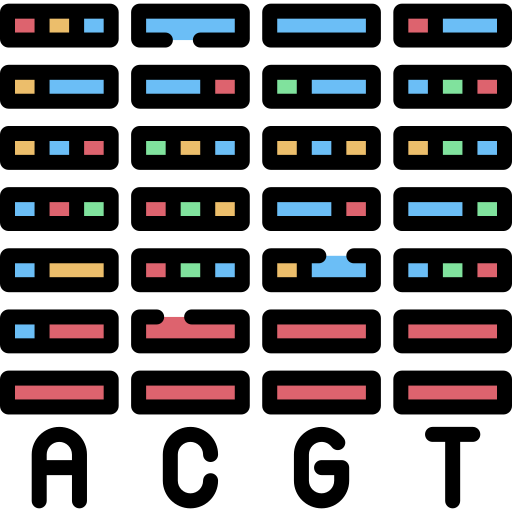

<div id="top"></div>

<!-- PROJECT SHIELDS -->
<!--
*** I'm using markdown "reference style" links for readability.
*** Reference links are enclosed in brackets [ ] instead of parentheses ( ).
*** See the bottom of this document for the declaration of the reference variables
*** for contributors-url, forks-url, etc. This is an optional, concise syntax you may use.
*** https://www.markdownguide.org/basic-syntax/#reference-style-links
-->
[![Contributors][contributors-shield]][contributors-url]
[![Forks][forks-shield]][forks-url]
[![Stargazers][stars-shield]][stars-url]
[![Issues][issues-shield]][issues-url]
[![MIT License][license-shield]][license-url]
[![LinkedIn][linkedin-shield]][linkedin-url]


<!-- PROJECT LOGO -->
<br />
<div align="center">
  <a href="https://github.com/othneildrew/Best-README-Template">
    
  </a>

  <h3 align="center">Metabar Coding Pipeline</h3>

  <p align="center">
    Python scripts to automate the creation of OTU tables.
    <br />
    <a href="https://github.com/mkuenzl/metabar-coding"><strong>Explore the docs »</strong></a>
    <br />
    <br />
    <a href="https://github.com/mkuenzl/metabar-coding">View Demo</a>
    ·
    <a href="https://github.com/mkuenzl/metabar-coding/issues">Report Bug</a>
    ·
    <a href="https://github.com/mkuenzl/metabar-coding/issues">Request Feature</a>
  </p>
</div>


<!-- TABLE OF CONTENTS -->
<details>
  <summary>Table of Contents</summary>
  <ol>
    <li>
      <a href="#about-the-project">About The Project</a>
      <ul>
        <li><a href="#built-with">Built With</a></li>
      </ul>
    </li>
    <li>
      <a href="#getting-started">Getting Started</a>
      <ul>
        <li><a href="#prerequisites">Prerequisites</a></li>
        <li><a href="#installation">Installation</a></li>
      </ul>
    </li>
    <li><a href="#usage">Usage</a></li>
    <li><a href="#roadmap">Roadmap</a></li>
    <li><a href="#contributing">Contributing</a></li>
    <li><a href="#license">License</a></li>
    <li><a href="#contact">Contact</a></li>
    <li><a href="#acknowledgments">Acknowledgments</a></li>
  </ol>
</details>


<!-- ABOUT THE PROJECT -->
## About The Project

[![Product Name Screen Shot][product-screenshot]](https://www.sciencedirect.com/science/article/pii/S2351989418303500?via%3Dihub)

With the help of NGS, it is possible to determine species richness without invasive intervention in the environment. 
Target primers can be used to analyze large numbers of samples using PCR and index PCR. 
For example, a water sample is taken from a body of water and analyzed for environmental DNA. 
Environmental DNA includes all DNA residues from e.g. urine, dander and saliva etc. The DNA is then isolated and amplified. 
This is then isolated and amplified. In the last step, the processed samples are illuminasequenced. 
The results of the sequencing have to be bioinformatically processed to be able to evaluate the information.

There are a lot of programs and libaries which already do what we are trying to automate here, but they are difficult to use. 

* [DECIPHER KEGG](http://www2.decipher.codes/Downloads.html)
* [UNITE](https://unite.ut.ee/repository.php)
* [DADA](https://benjjneb.github.io/dada2/training.html)
* [Silva](https://zenodo.org/record/1447330)

<p align="right">(<a href="#top">back to top</a>)</p>


### Built With

A linux system - we build on ubuntu

A lot of binaries which should be added to the `$path`

* [FastQC](https://www.bioinformatics.babraham.ac.uk/projects/fastqc/) (Quality check of sequences)
* [Pear](https://www.h-its.org/de/downloads/pear-academic/) (Assembly of paired reads and quality trimming)
* [FastX Toolkit](http://hannonlab.cshl.edu/fastx_toolkit/download.html) (Quality filter assembled fastq sequences and transform to fasta files)
* [Usearch](https://www.drive5.com/usearch/download.html) (Sequence dereplication, OTU clustering and building of OTU table)
* [Blastn](https://blast.ncbi.nlm.nih.gov/Blast.cgi?CMD=Web&PAGE_TYPE=BlastDocs&DOC_TYPE=Download) (Assign taxonomy to OTUs)
* [TaxonKit](https://bioinf.shenwei.me/taxonkit/)

<p align="right">(<a href="#top">back to top</a>)</p>


<!-- GETTING STARTED -->
## Getting Started

This is an example of how you may give instructions on setting up your project locally.
To get a local copy up and running follow these simple example steps.

### Prerequisites

Prepare your primer sequences.

| species           | primer        | direction | sequence           | amplicon size |
|-------------------|---------------|----------|--------------------| ------------- |
| Newts	         | 12S V5 Primer | Forward  | TAGAACAGGCTCCTCTAG | Min: 73BP Max:110BP |
|                   |               | Reverse  | TTAGATACCCCACTATGC | |
| Fire Salamander	 | 12S Primer 	 | Forward	| ACACCGCCCGTCACCCT	 | Mean: 51BP Max 100BPG4 |
|                   |               | Reverse  | GTAYACTTACCATGTTACGACTT | |

### Installation

_Below is an example of how you can instruct your audience on installing and setting up your app. This template doesn't rely on any external dependencies or services._

This is an example of how to list things you need to use the software and how to install them.
* FastQC 
  ```sh
  download from https://www.bioinformatics.babraham.ac.uk/projects/fastqc/
  Use the INSTALL.txt to add the fastqc.perl script to your /usr/bin folder
  ```

* Blastn Taxonomy File 
  ```sh
  download ftp://ftp.ncbi.nlm.nih.gov/blast/db/taxdb.tar.gz
  add folder of unpacked file to path with "export BLASTDB=path/to/folder"
  ```

<p align="right">(<a href="#top">back to top</a>)</p>


<!-- USAGE EXAMPLES -->
## Usage

Example usage without the use of this pipeline.

1. Check the quality <br/>
```
fastqc FILE
```
2. Assemble forward and reverse sequences <br/>
```
pear -f FW.fastq.gz -r RV.fastq.gz -q 20 -v 50 -o FILENAME
```
3. Quality filter, remove with less than 90% bases with Q30 or higher <br/> 
```
fastq_quality_filter -Q33 -p 90 -q 30 -i  FILE.fastq -o FILE_Q30.fastq
```
4. Transform fastq file to fasta format <br/> 
```
fastq_to_fasta -Q33 -i FILE_Q30.fastq -o FILENAME.fasta
```
5. Filter all sequences from fasta file <br/> 
```
grep -E -B1 “^forwardPrimerSequence.*reverseComplementOfReversePrimerSequence$” FILE.fasta > NEWFILE.fasta
```
 (Degenerate primers GTAAC[A-Z]GTATA[A-Z]CCCTTG or GTAAC.GTATA.CCCTTG)
6. Trim off primer sequences <br/> 
```
grep -E -B1 “^forwardPrimerSequence.*reverseComplementOfReversePrimerSequence$” FILE.fasta 
        | sed -r ‘/^[A-Z]/s/^.{22}//’ 
                | sed -r ‘/^[A-Z]/s/.{26}$//’ > NEWFILE.fasta
```
7. Filter by 6bp inline barcode <br/> 
```
grep -E -B1 “^Barcode” FILENAME.fasta > NEWFILE.fasta
```
8. OTU Clustering 
    - Merge and count identical sequences <br/> 
        ```
        usearch -fastx_uniques FILE.fasta -fastaout FILE.uniq.fasta -sizeout
        ```
    - OTU clustering and generation of centroid sequence database based on divergence cuttoff <br/> 
        ```
        usearch -cluster_otus FILE.uniq.fasta -otus FILE.otus.fasta  -relabel OUT -minsize 10
        ```
9. BLAST against NCBI database <br/>
   QUERY.fasta are equal to finale fasta file with DNA code  <br/> 
   Output format: (https://www.metagenomics.wiki/tools/blast/blastn-output-format-6) <br/>
   FORMATTER "6 staxids qseqid sseqid pident evalue sscinames scomnames sblastnames sskingdoms stitle salltitles sstrand"
```
Run on your PC with a database
blastn -db database.fasta -query QUERY.fasta -outfmt 6 -max_target_seqs 1 -out FILE.out

Run on Blast Webserver with their databases 
blastn -db nt -query QUERY.fasta -outfmt FORMATTER -max_target_seqs 1 -out FILE.out -remote
```
10. Generate OTU table by comparing all sequences against  database <br/> 
```
usearch -usearch_global Database.fasta -db FILE.otus.fasta -strand plus -id 0.97 -otutabout otu_table.txt
```

<p align="right">(<a href="#top">back to top</a>)</p>


<!-- ROADMAP -->
## Roadmap

- [x] Add Changelog
- [ ] Multi-language Support
    - [ ] Chinese
    - [ ] Spanish

See the [open issues](https://github.com/mkuenzl/metabar-coding/issues) for a full list of proposed features (and known issues).

<p align="right">(<a href="#top">back to top</a>)</p>


<!-- CONTRIBUTING -->
## Contributing

Contributions are what make the open source community such an amazing place to learn, inspire, and create. Any contributions you make are **greatly appreciated**.

If you have a suggestion that would make this better, please fork the repo and create a pull request. You can also simply open an issue with the tag "enhancement".
Don't forget to give the project a star! Thanks again!

1. Fork the Project
2. Create your Feature Branch (`git checkout -b feature/AmazingFeature`)
3. Commit your Changes (`git commit -m 'Add some AmazingFeature'`)
4. Push to the Branch (`git push origin feature/AmazingFeature`)
5. Open a Pull Request

<p align="right">(<a href="#top">back to top</a>)</p>


<!-- LICENSE -->
## License

Distributed under the MIT License. See `LICENSE.txt` for more information.

<p align="right">(<a href="#top">back to top</a>)</p>


<!-- CONTACT -->
## Contact

Moritz Künzl - mo.kuenzl@gmail.com

Project Link: [https://github.com/mkuenzl/metabar-coding](https://github.com/mkuenzl/metabar-coding)

<p align="right">(<a href="#top">back to top</a>)</p>


<!-- ACKNOWLEDGMENTS -->
## Acknowledgments

Use this space to list resources you find helpful and would like to give credit to. I've included a few of my favorites to kick things off!

* [Choose an Open Source License](https://choosealicense.com)
* [Dna icons created by Freepik - Flaticon](https://www.flaticon.com/free-icons/dna)
* [Krista M. Ruppert, Richard J. Kline and Md Saydur Rahman - Applications of environmental DNA metabarcoding in aquatic and terrestrial ecosystems](https://www.sciencedirect.com/science/article/pii/S2351989418303500?via%3Dihub) | licensed under [CC BY-SA 4.0](https://creativecommons.org/licenses/by-sa/4.0/)

<p align="right">(<a href="#top">back to top</a>)</p>


<!-- MARKDOWN LINKS & IMAGES -->
<!-- https://www.markdownguide.org/basic-syntax/#reference-style-links -->
[contributors-shield]: https://img.shields.io/github/contributors/mkuenzl/metabar-coding.svg?style=for-the-badge
[contributors-url]: https://github.com/mkuenzl/metabar-coding/graphs/contributors
[forks-shield]: https://img.shields.io/github/forks/mkuenzl/metabar-coding.svg?style=for-the-badge
[forks-url]: https://github.com/mkuenzl/metabar-coding/network/members
[stars-shield]: https://img.shields.io/github/stars/mkuenzl/metabar-coding.svg?style=for-the-badge
[stars-url]: https://github.com/mkuenzl/metabar-coding/stargazers
[issues-shield]: https://img.shields.io/github/issues/mkuenzl/metabar-coding.svg?style=for-the-badge
[issues-url]: https://github.com/mkuenzl/metabar-coding
[license-shield]: https://img.shields.io/github/license/mkuenzl/metabar-coding.svg?style=for-the-badge
[license-url]: https://github.com/mkuenzl/metabar-coding/blob/master/LICENSE.txt
[linkedin-shield]: https://img.shields.io/badge/-LinkedIn-black.svg?style=for-the-badge&logo=linkedin&colorB=555
[linkedin-url]: https://linkedin.com/in/moritz-kuenzl
[product-screenshot]: images/Applications_of_environmental_DNA_metabarcoding_in_aquatic_and_terrestrial_ecosystems.jpg

